# QAssist - System Architecture Specification

## Tech Stack Summary

- **Frontend:** Next.js 15 (App Router, React 18, React Server Components)
- **Backend:** Next.js API Routes + Supabase Edge Functions
- **Database:** PostgreSQL 15 via Supabase (with Row Level Security)
- **Authentication:** Supabase Auth (JWT-based, OAuth providers)
- **Storage:** Supabase Storage (S3-compatible, CDN-backed)
- **Hosting:** Vercel (Edge Network, Serverless Functions)
- **CI/CD:** GitHub Actions
- **Monitoring:** Vercel Analytics, Sentry (error tracking)
- **External APIs:** Jira REST API v3, Stripe API

---

## 1. System Architecture (C4 Level 1 & 2)

### Level 1: System Context Diagram

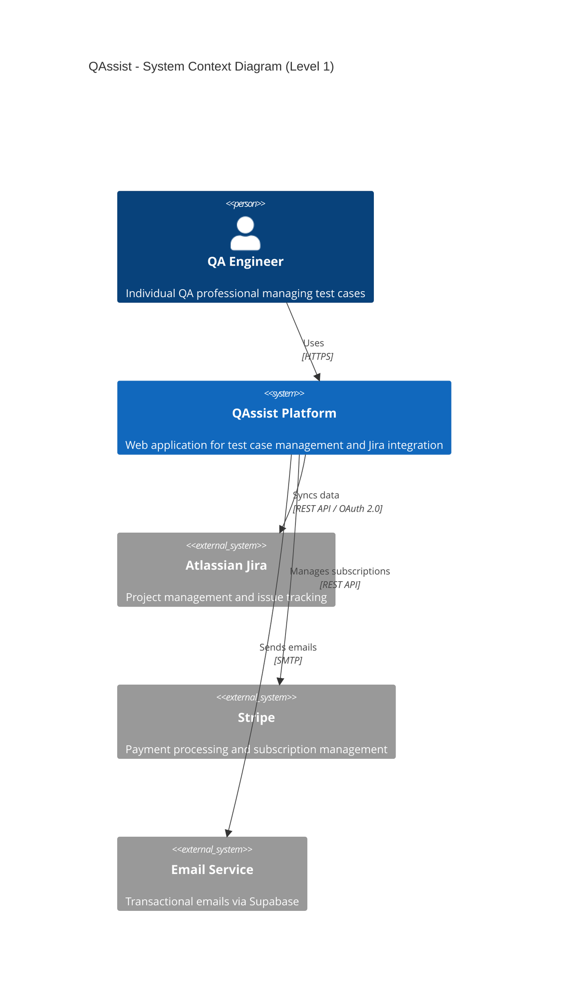

### Level 2: Container Diagram

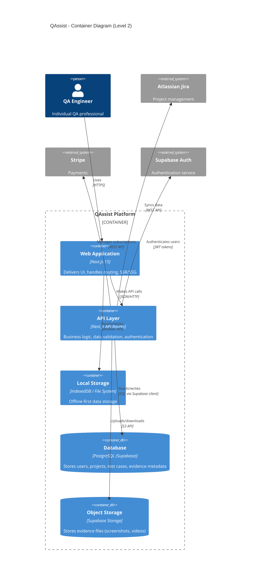

### Component Interaction Flow

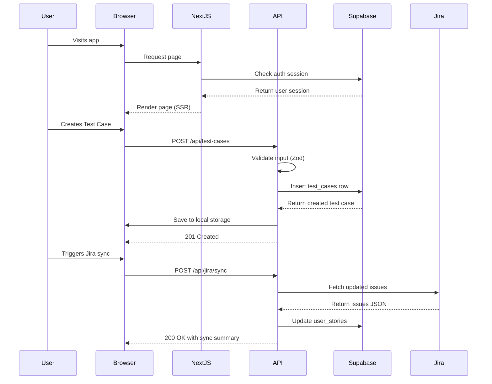

---

## 2. Database Design (Entity-Relationship Diagram)

### ERD - Core Entities

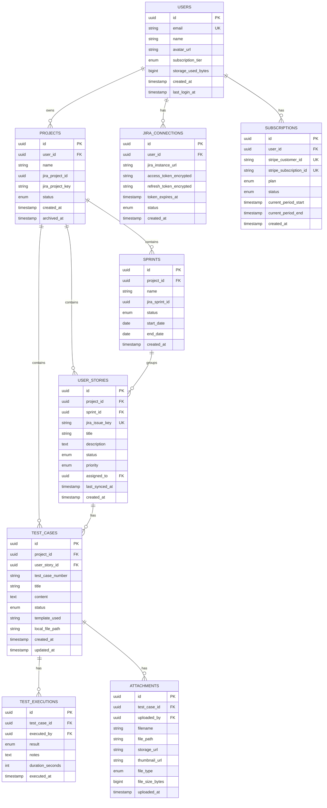

### Additional Support Tables

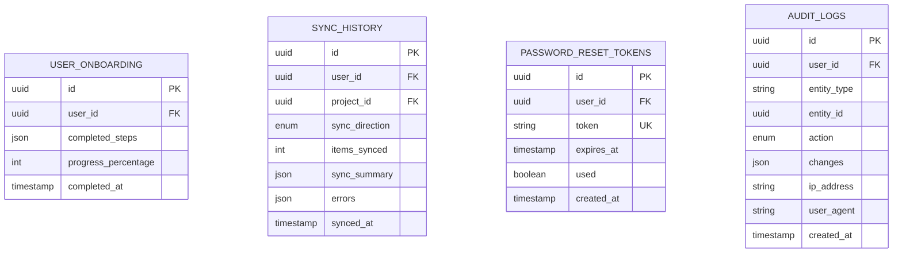

### Database Schema Notes

**Important:** The actual database schema will be managed via Supabase migrations. For real-time schema information, use:

```bash
# Get current schema via Supabase MCP
supabase db diff --schema public

# Generate TypeScript types from schema
supabase gen types typescript --local > types/supabase.ts
```

**Row Level Security (RLS) Policies:**
- All tables have RLS enabled
- Users can only access their own data (filtered by `user_id` or `project.user_id`)
- Admin role has read-only access to all tables (for metrics dashboard)

**Indexes:**
- Primary keys: Automatic B-tree index
- Foreign keys: Indexed for JOIN performance
- `user_stories.jira_issue_key`: Unique index for fast lookups
- `test_cases(project_id, created_at)`: Composite index for sorting
- `test_cases.content`: GIN index for full-text search (using `tsvector`)

---

## 3. Tech Stack Justification

### Frontend: Next.js 15 (App Router)

- **Component:** Next.js 15 with App Router
- **Why Chosen:**
  - ✅ **React Server Components:** Reduces client-side JavaScript, improves LCP (< 2s target)
  - ✅ **File-based routing:** Intuitive DX, automatic code splitting per route
  - ✅ **Built-in API routes:** Full-stack framework, no separate backend server needed
  - ✅ **Incremental Static Regeneration (ISR):** Cache static pages, revalidate on-demand
  - ✅ **Edge Functions:** Run code closer to users (Vercel Edge Network)
  - ✅ **Image optimization:** Automatic WebP conversion, responsive images
  - ❌ **Trade-off:** App Router learning curve (different from Pages Router), some libs not compatible yet

### UI Framework: React 18

- **Component:** React 18 (with Concurrent Features)
- **Why Chosen:**
  - ✅ **Industry standard:** Massive ecosystem, extensive community support
  - ✅ **Server Components:** Enables Next.js RSC, reduces bundle size
  - ✅ **Suspense:** Better loading states, streaming SSR
  - ✅ **Hooks:** Modern API, easier state management
  - ❌ **Trade-off:** Larger bundle size than Svelte/Preact (mitigated with RSC)

### UI Component Library: shadcn/ui + Tailwind CSS

- **Component:** shadcn/ui (Radix UI primitives) + Tailwind CSS
- **Why Chosen:**
  - ✅ **Copy-paste components:** No runtime dependency, full control over code
  - ✅ **Accessible by default:** Radix UI primitives follow WCAG 2.1 AA
  - ✅ **Tailwind CSS:** Utility-first, rapid prototyping, consistent design system
  - ✅ **Customizable:** Full control over styling, no black-box components
  - ❌ **Trade-off:** More setup than pre-packaged UI libs (MUI, Ant Design)

### Backend: Next.js API Routes + Supabase Edge Functions

- **Component:** Next.js API Routes (Serverless Functions)
- **Why Chosen:**
  - ✅ **Collocated with frontend:** Single codebase, shared types, easier DX
  - ✅ **Serverless:** Auto-scaling, pay-per-execution (cost-efficient for MVP)
  - ✅ **Edge deployment:** Low latency via Vercel Edge Network
  - ✅ **TypeScript-first:** Full type safety from frontend to backend
  - ❌ **Trade-off:** 10s execution limit (Hobby), 60s (Pro) - not suitable for long-running jobs

- **Component:** Supabase Edge Functions (Deno-based)
- **Why Chosen:**
  - ✅ **Alternative for long jobs:** PDF generation, Jira sync, background tasks
  - ✅ **Deno runtime:** Secure by default, TypeScript native, Web API compatible
  - ✅ **Database proximity:** Lower latency, direct PostgREST access
  - ❌ **Trade-off:** Different runtime than Node.js (some npm packages incompatible)

### Database: PostgreSQL 15 (via Supabase)

- **Component:** PostgreSQL 15 with Supabase managed service
- **Why Chosen:**
  - ✅ **Powerful relational DB:** ACID compliance, complex queries, full-text search
  - ✅ **Row Level Security (RLS):** Database-level authorization, no API bypass
  - ✅ **JSON support:** Flexible schema for metadata (`jsonb` columns)
  - ✅ **Full-text search:** Built-in `tsvector` + GIN index (no need for Elasticsearch)
  - ✅ **Supabase benefits:** Managed backups, automatic scaling, real-time subscriptions
  - ❌ **Trade-off:** More complex than NoSQL (Firestore), requires schema migrations

### Authentication: Supabase Auth

- **Component:** Supabase Auth (GoTrue-based)
- **Why Chosen:**
  - ✅ **JWT tokens:** Stateless, scalable, works with RLS policies
  - ✅ **Built-in providers:** Email/password, OAuth (Google, GitHub, etc.)
  - ✅ **Session management:** Automatic token refresh, secure cookie storage
  - ✅ **Multi-factor auth (MFA):** TOTP support (future Pro feature)
  - ✅ **Passwordless login:** Magic links, OTP (future enhancement)
  - ❌ **Trade-off:** Tied to Supabase ecosystem (migration cost if switching providers)

### Object Storage: Supabase Storage

- **Component:** Supabase Storage (S3-compatible)
- **Why Chosen:**
  - ✅ **S3-compatible:** Standard API, easy to migrate if needed
  - ✅ **CDN integration:** Automatic caching via Supabase CDN
  - ✅ **RLS integration:** File access controlled by database policies
  - ✅ **Image transformations:** On-the-fly resize, format conversion
  - ✅ **Resumable uploads:** TUS protocol for large files
  - ❌ **Trade-off:** More expensive than raw S3 at scale (mitigated by CDN caching)

### Hosting: Vercel

- **Component:** Vercel (Serverless + Edge Network)
- **Why Chosen:**
  - ✅ **Next.js native:** Zero-config deployment, automatic optimizations
  - ✅ **Global CDN:** 100+ edge locations, low latency worldwide
  - ✅ **Preview deployments:** Automatic for every PR, easy testing
  - ✅ **Analytics:** Built-in Web Vitals monitoring, no additional setup
  - ✅ **Serverless Functions:** Auto-scaling, pay-per-execution
  - ❌ **Trade-off:** Vendor lock-in (mitigated by standard APIs, can deploy to AWS/GCP if needed)

### CI/CD: GitHub Actions

- **Component:** GitHub Actions
- **Why Chosen:**
  - ✅ **Native GitHub integration:** No separate CI service, unified workflow
  - ✅ **Free for open-source:** 2,000 min/month for private repos
  - ✅ **Matrix builds:** Test across Node versions, browsers
  - ✅ **Extensive marketplace:** Pre-built actions for common tasks
  - ❌ **Trade-off:** YAML config can get complex (mitigated with reusable workflows)

### Monitoring: Vercel Analytics + Sentry

- **Component:** Vercel Analytics (Web Vitals)
- **Why Chosen:**
  - ✅ **Zero-config:** Automatic with Vercel deployment
  - ✅ **Real User Monitoring (RUM):** Actual user metrics, not synthetic
  - ✅ **Core Web Vitals:** LCP, FID, CLS tracking
  - ❌ **Trade-off:** Basic compared to Datadog/New Relic (sufficient for MVP)

- **Component:** Sentry (Error Tracking)
- **Why Chosen:**
  - ✅ **Industry standard:** Mature product, extensive integrations
  - ✅ **Source maps:** Readable stack traces even with minified code
  - ✅ **Error grouping:** Intelligent aggregation, reduces noise
  - ✅ **Performance monitoring:** Slow API detection, transaction tracing
  - ❌ **Trade-off:** Quota limits on free tier (10k events/month)

### Payment Processing: Stripe

- **Component:** Stripe (Checkout + Billing)
- **Why Chosen:**
  - ✅ **PCI compliance:** Stripe handles all card data (SAQ A)
  - ✅ **Hosted checkout:** No need to build payment forms
  - ✅ **Subscription management:** Automatic billing, proration, dunning
  - ✅ **Webhooks:** Real-time subscription status updates
  - ✅ **Developer-friendly:** Excellent docs, test mode, CLI
  - ❌ **Trade-off:** 2.9% + $0.30 per transaction fee (industry standard)

### Type Safety: TypeScript (Strict Mode)

- **Component:** TypeScript 5.x (Strict Mode)
- **Why Chosen:**
  - ✅ **Compile-time safety:** Catch errors before runtime
  - ✅ **IntelliSense:** Better DX, autocomplete, refactoring
  - ✅ **Supabase types:** Auto-generated from schema, end-to-end type safety
  - ✅ **API contracts:** Zod schemas ensure runtime validation matches types
  - ❌ **Trade-off:** Slower compilation (mitigated with SWC in Next.js)

### Validation: Zod

- **Component:** Zod (Schema validation)
- **Why Chosen:**
  - ✅ **TypeScript-first:** Infer types from schemas, single source of truth
  - ✅ **Runtime validation:** Protect API routes from invalid inputs
  - ✅ **Composable:** Reuse schemas, build complex validations
  - ✅ **Error messages:** Customizable, user-friendly
  - ❌ **Trade-off:** Slightly larger bundle than Yup (6KB vs 4KB)

---

## 4. Data Flow Examples

### 4.1 User Registration Flow

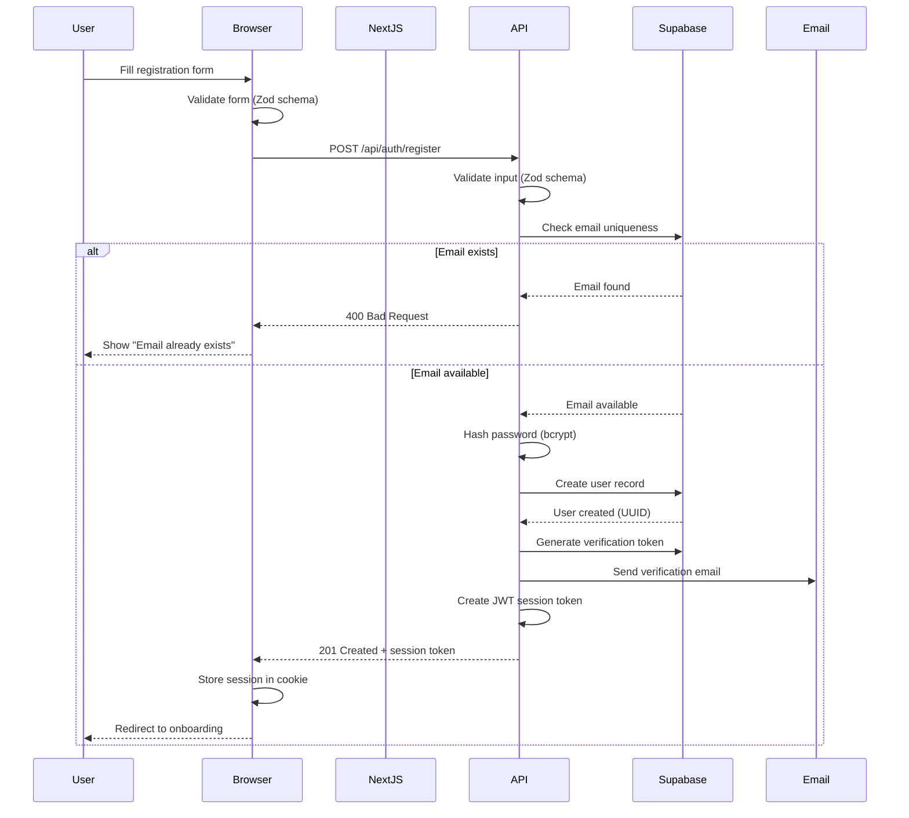

**Steps:**
1. User submits registration form (email, password, consent)
2. Client validates input with Zod schema (instant feedback)
3. POST request to `/api/auth/register` with form data
4. Server validates input again (never trust client)
5. Check email uniqueness: `SELECT email FROM users WHERE email = ?`
6. Hash password with bcrypt (salt rounds: 10)
7. Create user: `INSERT INTO users (email, password_hash) VALUES (?, ?)`
8. Generate email verification token (UUID v4, expires 24h)
9. Send verification email via Supabase Email
10. Generate JWT session token (expires 7 days)
11. Return response: `{ user: { id, email }, session_token }`
12. Client stores session token in httpOnly cookie
13. Redirect to onboarding page

---

### 4.2 Jira OAuth Connection Flow

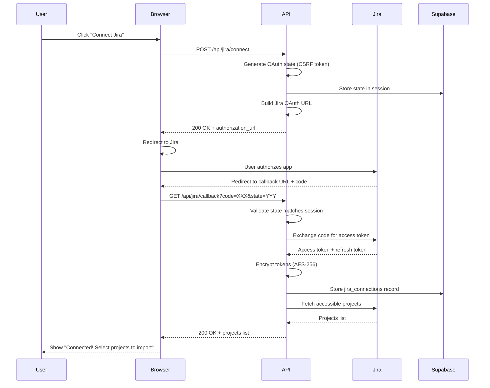

**Steps:**
1. User clicks "Connect Jira" button
2. POST to `/api/jira/connect`
3. Generate OAuth state parameter (UUID v4 for CSRF protection)
4. Store state in server session: `INSERT INTO oauth_states (state, user_id, expires_at)`
5. Build Jira authorization URL:
   ```
   https://auth.atlassian.com/authorize?
     client_id=XXX&
     redirect_uri=https://qassist.io/api/jira/callback&
     state=YYY&
     scope=read:jira-work write:jira-work
   ```
6. Return authorization URL to client
7. Client redirects user to Jira consent screen
8. User approves permissions in Jira
9. Jira redirects to callback: `/api/jira/callback?code=ABC&state=YYY`
10. Validate state matches stored value (prevent CSRF)
11. Exchange authorization code for access token via Jira OAuth API
12. Encrypt access token and refresh token (AES-256-GCM)
13. Store in database: `INSERT INTO jira_connections (user_id, access_token_encrypted, ...)`
14. Fetch user's accessible Jira projects: `GET /rest/api/3/project/search`
15. Return projects list to client
16. Client displays project selection UI

---

### 4.3 Test Case Creation with Evidence Flow

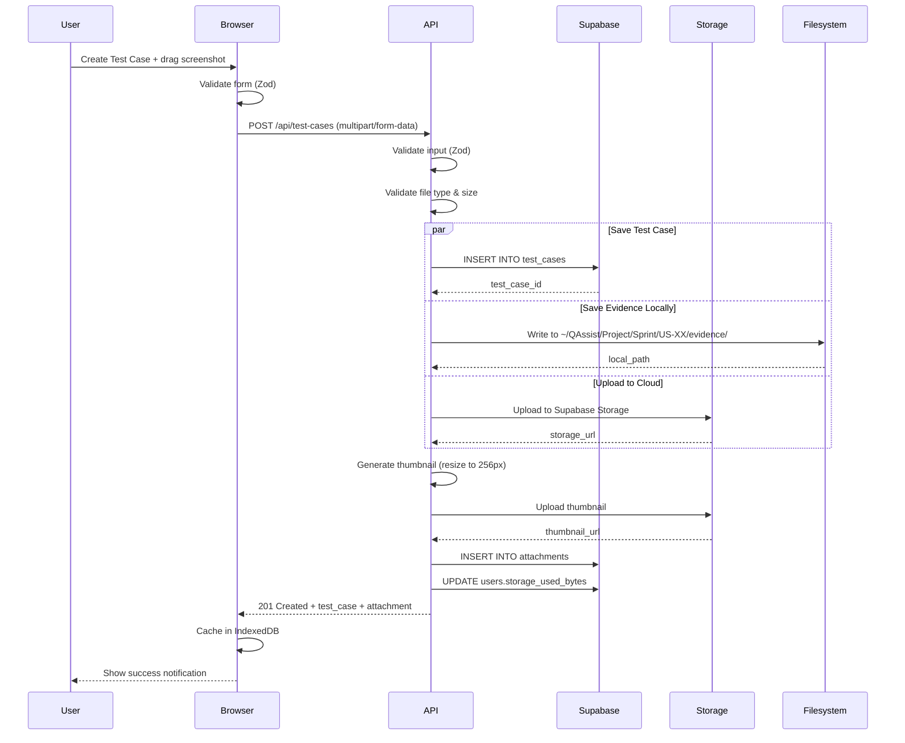

**Steps:**
1. User fills Test Case form (title, content, template)
2. User drags screenshot file into editor
3. Client validates: File type (JPEG/PNG), size (< 10MB)
4. Browser sends `POST /api/test-cases` with multipart/form-data:
   - `title`, `content`, `user_story_id`
   - `file` (binary data)
5. Server validates input with Zod schema
6. Server validates file type (check MIME + file signature, not just extension)
7. Generate unique Test Case ID: `TC-{project_counter++}`
8. **Parallel operations:**
   - Insert Test Case: `INSERT INTO test_cases (id, title, content, user_story_id, ...)`
   - Save file locally: Write to `~/QAssist/{project}/{sprint}/{user_story}/evidence/{timestamp}_{filename}`
   - Upload to Supabase Storage: `storage.upload(bucket, path, file)`
9. Generate thumbnail: Resize image to 256px width (maintain aspect ratio)
10. Upload thumbnail to storage
11. Create attachment record: `INSERT INTO attachments (test_case_id, filename, storage_url, local_path, ...)`
12. Update user storage usage: `UPDATE users SET storage_used_bytes = storage_used_bytes + file_size`
13. Return response: `{ test_case: {...}, attachment: {...} }`
14. Client caches data in IndexedDB (offline support)
15. Client shows success notification: "Test Case TC-042 created ✓"

---

### 4.4 Offline Mode & Sync Flow

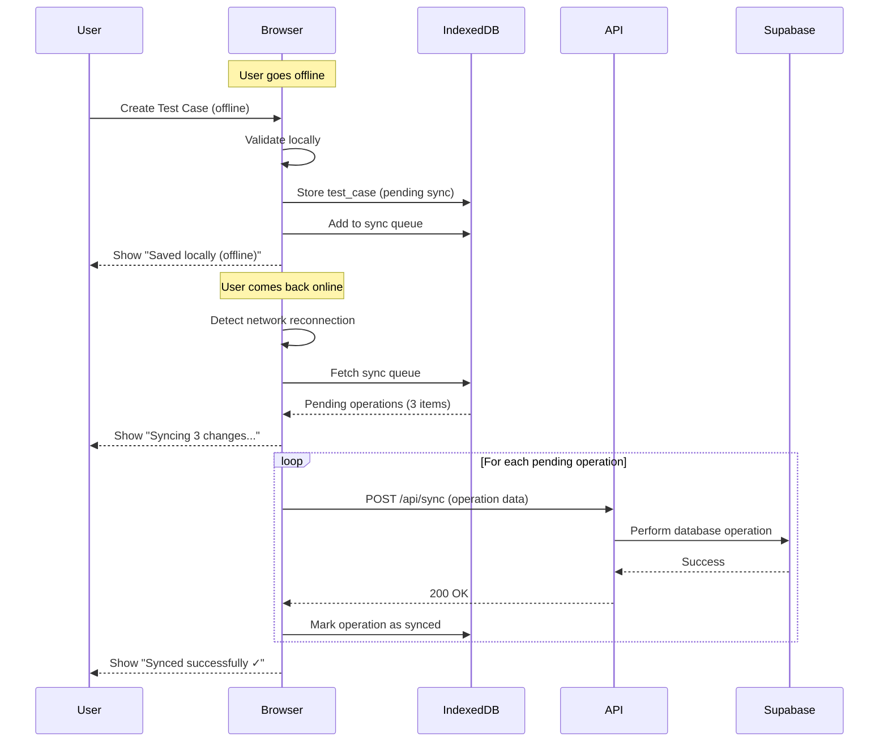

**Steps:**
1. User works offline (network unavailable)
2. User creates Test Case
3. Client validates input locally (Zod schema)
4. Save to IndexedDB: `{ test_case: {...}, status: "pending_sync" }`
5. Add to sync queue: `{ operation: "CREATE", entity: "test_case", data: {...} }`
6. Show notification: "Saved locally (offline mode)"
7. User reconnects to network
8. Browser detects network via `navigator.onLine` event
9. Fetch sync queue from IndexedDB
10. For each pending operation:
    - Send POST to `/api/sync` with operation data
    - Server processes operation (idempotent - checks for duplicates)
    - Server returns success or conflict
    - Client marks operation as synced in queue
11. Show progress: "Syncing 2 of 3 changes..."
12. When all synced, show: "Synced successfully ✓"
13. Clear sync queue

**Conflict Resolution:**
- Local changes always preserved (user never loses data)
- Server changes merged with local changes
- If conflict detected (e.g., Test Case deleted in Jira but modified locally):
  - Show modal: "Conflict detected. Keep local version or discard?"
  - User chooses action

---

## 5. Security Architecture

### 5.1 Authentication Flow

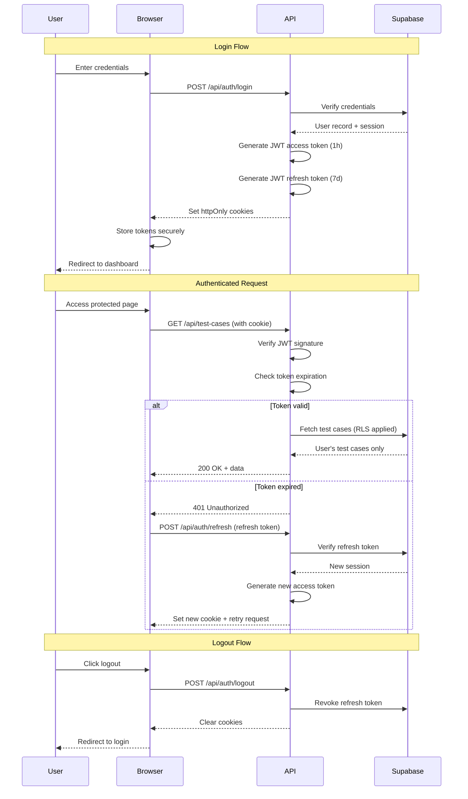

### 5.2 Row Level Security (RLS) Policies

**PostgreSQL RLS ensures data isolation at database level:**

```sql
-- Example RLS policy for projects table
ALTER TABLE projects ENABLE ROW LEVEL SECURITY;

CREATE POLICY "Users can view own projects"
  ON projects FOR SELECT
  USING (auth.uid() = user_id);

CREATE POLICY "Users can insert own projects"
  ON projects FOR INSERT
  WITH CHECK (auth.uid() = user_id);

CREATE POLICY "Users can update own projects"
  ON projects FOR UPDATE
  USING (auth.uid() = user_id);

CREATE POLICY "Users can delete own projects"
  ON projects FOR DELETE
  USING (auth.uid() = user_id);
```

**Benefits:**
- Authorization enforced at database level (can't be bypassed via API)
- Automatic filtering: `SELECT * FROM projects` only returns user's projects
- Secure by default: Requires explicit policies to allow access
- Works with Supabase client: `supabase.from('projects').select()` automatically filtered

### 5.3 Data Protection Layers

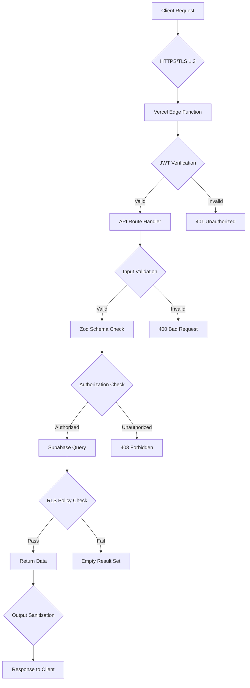

**Security Layers:**
1. **Transport Layer:** HTTPS/TLS 1.3 (all requests encrypted in transit)
2. **Authentication Layer:** JWT verification (Supabase Auth)
3. **Input Validation:** Zod schema validation (prevent injection attacks)
4. **Authorization Layer:** API route checks (user ownership)
5. **Database Layer:** RLS policies (final defense)
6. **Output Sanitization:** HTML escaping, XSS prevention

### 5.4 Secrets Management

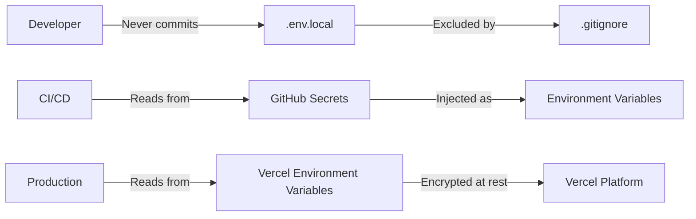

**Secrets Handling:**
- **Local Development:** `.env.local` (never committed)
- **CI/CD:** GitHub Secrets (encrypted, scoped to repo)
- **Production:** Vercel Environment Variables (encrypted at rest)
- **Sensitive Fields:** Jira tokens encrypted with AES-256-GCM before DB storage
- **Key Rotation:** Quarterly rotation of API keys, Jira tokens refreshed automatically via OAuth

### 5.5 API Security Best Practices

| Threat | Mitigation |
|--------|-----------|
| **SQL Injection** | Parameterized queries only (Supabase client), never string concatenation |
| **XSS (Cross-Site Scripting)** | DOMPurify for HTML sanitization, Content Security Policy (CSP) header |
| **CSRF (Cross-Site Request Forgery)** | SameSite cookies, CSRF tokens for state-changing operations |
| **Clickjacking** | `X-Frame-Options: DENY` header |
| **MIME Sniffing** | `X-Content-Type-Options: nosniff` header |
| **Man-in-the-Middle** | HTTPS enforced, HSTS header (max-age 1 year) |
| **Brute Force** | Rate limiting (5 failed logins → CAPTCHA required) |
| **DDoS** | Vercel WAF, Cloudflare (future), rate limiting per IP |
| **Session Hijacking** | httpOnly cookies, Secure flag, SameSite=Strict |
| **Token Leakage** | Short-lived access tokens (1h), never log tokens, never expose in URLs |

---

## 6. Deployment Architecture

### 6.1 Deployment Pipeline

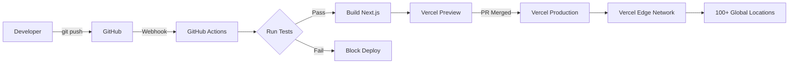

**Pipeline Steps:**
1. Developer pushes to feature branch
2. GitHub Actions triggers:
   - Lint (ESLint)
   - Type check (TypeScript)
   - Unit tests (Vitest)
   - E2E tests (Playwright - on main only)
3. If checks pass, Vercel creates preview deployment
4. Preview URL shared in PR comment
5. Manual QA on preview environment
6. PR merged to main
7. Vercel auto-deploys to production
8. Edge network cache invalidated
9. Health check (synthetic monitoring)
10. Rollback if health check fails (automatic)

### 6.2 Environment Strategy

| Environment | Purpose | Database | URL | Auto-Deploy |
|-------------|---------|----------|-----|-------------|
| **Local** | Development | Supabase local (Docker) | localhost:3000 | Manual |
| **Preview** | PR testing | Supabase staging | {branch}.vercel.app | Per PR push |
| **Staging** | Pre-prod testing | Supabase staging | staging.qassist.io | On main merge |
| **Production** | Live users | Supabase production | qassist.io | On release tag |

**Database Migrations:**
- Local: `supabase db reset` (applies all migrations)
- Staging/Prod: `supabase db push` (applies pending migrations)
- Versioned in Git: `supabase/migrations/*.sql`
- Reviewed in PR before merge

---

## 7. Scalability & Performance

### 7.1 Caching Strategy

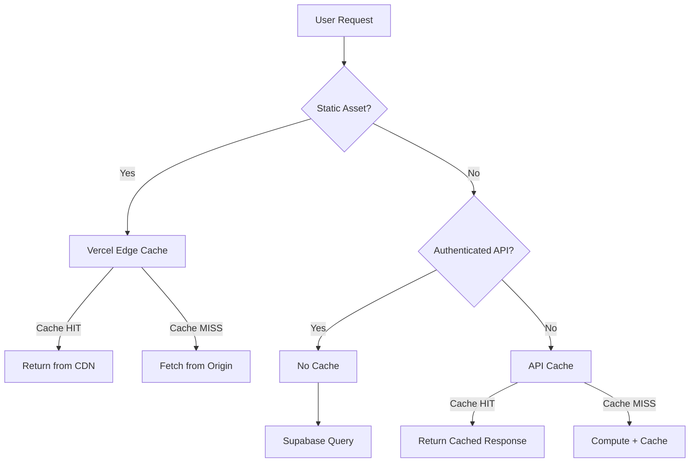

**Cache Policies:**
- **Static Assets:** 1 year (`immutable`)
- **API (public):** 5 minutes
- **API (authenticated):** No cache (user-specific data)
- **ISR Pages:** Revalidate every 1 hour
- **Database Queries:** No caching (rely on PostgreSQL query cache)

### 7.2 Database Connection Pooling

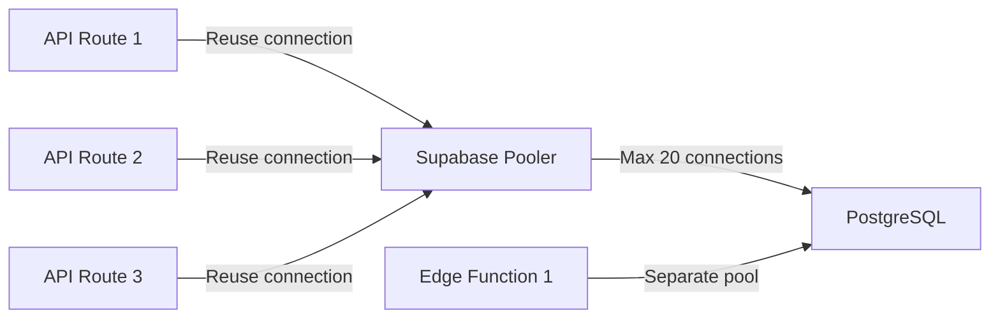

**Configuration:**
- **Supabase Pooler:** PgBouncer in transaction mode
- **Max Connections:** 20 (Free), 50 (Pro Supabase plan)
- **Connection Timeout:** 30 seconds
- **Idle Timeout:** 10 minutes (connections returned to pool)

### 7.3 Load Testing Strategy

**Tools:** k6 or Artillery

**Scenarios:**
1. **Baseline:** 10 concurrent users, 5 min duration
2. **Expected Load:** 100 concurrent users, 10 min duration
3. **Stress Test:** 500 concurrent users, 5 min duration (expect degradation)
4. **Spike Test:** Ramp from 10 to 200 users in 1 min, hold 5 min

**Critical Flows to Test:**
- User login/registration
- Jira sync (most API-intensive)
- Test Case creation with evidence upload
- PDF export (CPU-intensive)

**Success Criteria:**
- p95 latency < 1s under expected load
- 0% error rate under expected load
- < 5% error rate under stress test
- System recovers after spike (no memory leaks)

---

## Summary

**Architecture Highlights:**
- **Monorepo:** Single Next.js codebase (frontend + API routes)
- **Database-Centric:** PostgreSQL with RLS as security foundation
- **Offline-First:** IndexedDB + local file system for resilience
- **Stateless API:** Enables horizontal scaling via Vercel serverless
- **Defense in Depth:** Multiple security layers (TLS, JWT, validation, RLS)

**Key Design Decisions:**
1. **Next.js 15 over separate frontend/backend:** Simplifies development, shared types, single deployment
2. **Supabase over custom backend:** Faster MVP, managed database, built-in auth
3. **PostgreSQL over NoSQL:** Complex queries, full-text search, ACID compliance
4. **Vercel over AWS/GCP:** Zero-config Next.js optimization, global CDN, easy preview deployments
5. **TypeScript Strict Mode:** Catch errors at compile-time, not runtime

**Trade-offs Accepted:**
- Vercel vendor lock-in → Mitigated by standard APIs (can migrate to AWS/GCP if needed)
- 10s serverless timeout → Use Supabase Edge Functions for long jobs
- Supabase ecosystem dependency → Benefits outweigh migration cost for MVP

**Next Steps:**
- Define API contracts (endpoints, request/response schemas)
- Implement database migrations
- Set up CI/CD pipeline (GitHub Actions + Vercel)
- Configure monitoring (Sentry + Vercel Analytics)
